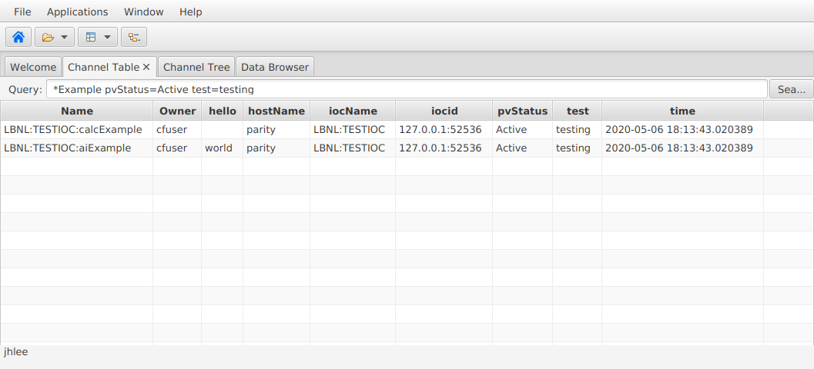

# DB info tag
In order to assign a value to predefined CF properties through EPICS DB `info` tag, one should define predefined tags in reccast configuration file, i.e., `recsync.conf`.

This environment provide the following variables for testing purposes:
```bash
archive
test
hello
```
are defined in `CF_PROPERTIES` valiables in `configure/CONFIG_SITE`.

```bash
$ make PRINT.CF_PROPERTIES
CF_PROPERTIES = archive test hello
CF_PROPERTIES's origin is file
```

Its test DB can be found in [1].

```bash
	info(test, "testing")
	info(hello, "world")
```

||
| :---: |
|**Figure 1** Phoebus Channel Table Screenshot. |


[1] <https://github.com/jeonghanlee/ServiceTestIOC/blob/master/ServiceTestIOCApp/Db/dbExample1.db#L17>
